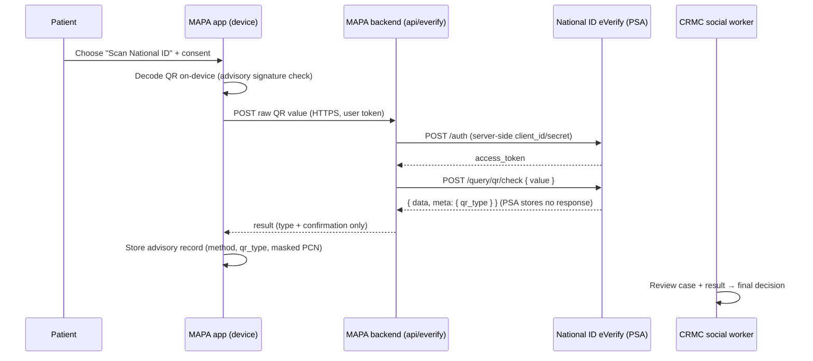

# Business-Process Map — National ID eVerify in MAPA

> **Draft for CRMC's eVerify regulatory onboarding.** PSA asks relying parties for
> a swimlane showing **data-capture points, the user-consent flow, and when/how
> authentication is triggered.** This text + the diagram below cover all three.
> Audience: PSA / NIDAS reviewers. Replace `[bracketed]` items.

## Scope
- **Relying party:** Cotabato Regional Medical Center (CRMC) — Malasakit Center.
- **System:** MAPA (Medical Assistance Portal Access).
- **Service requested:** Tier I — Basic Online Authentication via `POST /query/qr/check`.
- **Decision authority:** a CRMC social worker. eVerify is **advisory**; it never
  auto-approves or auto-rejects.

## Actors (swimlanes)
1. **Patient** (or authorized representative)
2. **MAPA app** (patient's device — browser/mobile)
3. **MAPA backend** (CRMC serverless proxy, `api/everify.js`)
4. **National ID eVerify** (PSA/NIDAS)
5. **CRMC social worker**

## Where identity data is captured
- On the patient's **own device only**: the National ID QR is scanned by the camera
  and decoded locally.
- The **raw QR value** is the sole datum sent for authentication. The 12-digit PSN
  is **never** collected. The PhilSys Card Number (PCN), where present, is stored
  only **masked (last 4)** plus a one-way fingerprint — never in raw form.

## When authentication is triggered
- Only when the patient **chooses "Scan National ID"** during a medical-assistance
  application **and** has given consent (below). National ID is a preferred but
  **optional** path — "Use another valid ID" remains an equal alternative
  (RA 11055). No background or bulk authentication occurs.

## Consent flow
1. Before scanning, MAPA shows a consent notice: *"If you scan, your National ID QR
   is sent to PSA (eVerify) to confirm it is genuine. Only the result is kept."*
2. The patient proceeds only by actively choosing to scan. Declining keeps the
   alternative-ID path fully available.
3. Consent is **per transaction**; it is recorded with the application.

## Step-by-step flow
1. **Patient** selects "Scan National ID" and consents.
2. **MAPA app** opens the camera, decodes the QR **on-device**, and does an advisory
   local signature check.
3. **MAPA app** sends the raw QR value to **MAPA backend** over HTTPS, authenticated
   with the signed-in user's token.
4. **MAPA backend** obtains an eVerify access token (`POST /auth`, server-side
   credentials never exposed to the device) and calls
   **`POST /query/qr/check { value }`**.
5. **National ID eVerify** validates + parses the QR and returns
   `{ data:{ pcn|digital_id|… }, meta:{ qr_type } }`. PSA stores no response.
6. **MAPA backend** returns only the result (type + confirmation) to the app; the
   app stores an advisory record (method, QR type, masked PCN) on the application.
7. **CRMC social worker** reviews the application, sees the eVerify result alongside
   the other documents and the live selfie, and **makes the final decision**
   (confirm identity / request redo).

## Data handling (RA 10173)
- **Minimization:** only the QR value is transmitted; only the result is retained.
- **No retention of raw ID data:** PSN never collected; PCN masked; fingerprint is
  one-way.
- **Transport:** HTTPS end to end; eVerify credentials held server-side only.
- **Retention/disposal:** per CRMC records policy — **[state retention period]**.
- **DPO:** **[name, email]**.

## Swimlane diagram (Mermaid)

